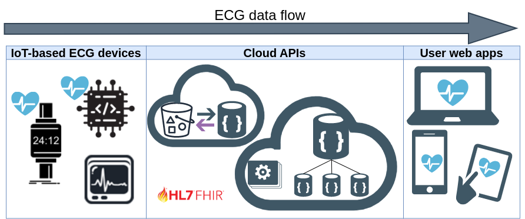
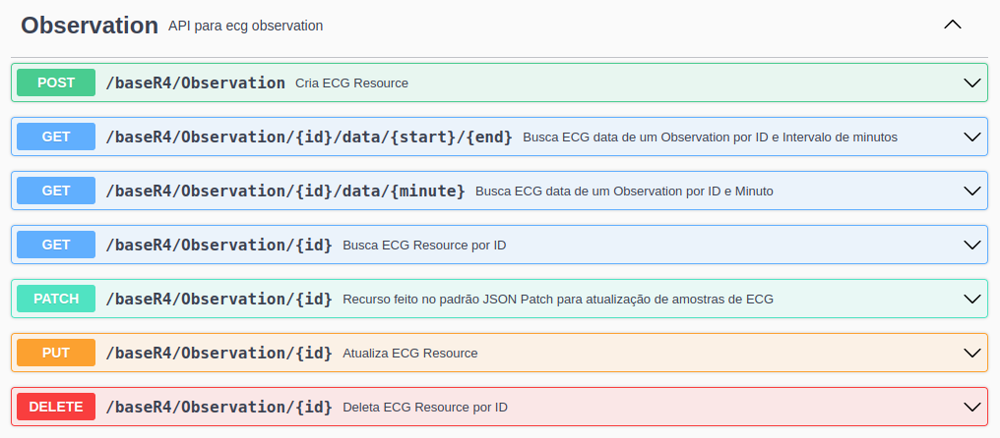
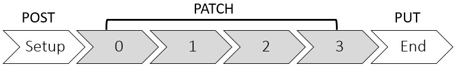

# FASS-ECG: FHIR API to Stream and Store long-term ECGs
  


This repo contains FASS-ECG, a FHIR Cloud API to Enable Streaming and Storage of Continuous 12-leads ECGs. Figure shows a general structure of an IoT-based ECG monitoring system containing diverse components labeled IoT devices, cloud APIs, and user-interface applications. FASS-ECG is a cloud API to enable the IoT-based ECG monitoring and FASS-ECG paper has been published in [IEEE CBMS 2023](https://2023.cbms-conference.org/) conference.


## Requirements
- NodeJS [https://nodejs.org/en/](https://nodejs.org/en/)
- MongoDB [https://www.mongodb.com/](https://www.mongodb.com/)
- FASS-ECG API (this repo)


## Instalation
1. Download this repo
```sh
git clone https://github.com/if4health/FASS-ECG .
```
2. Set the environment variables up:

| Name | Comment |
|------|-----------|
| `SERVER_PORT` | Server port |
| `DB_URI` | MongoDB connection string |
| `DB_NAME` | Database name |
| `AWS_BUCKET_NAME` | only config this when use `aws-s3` branch |
| `AWS_BUCKET_REGION` | only config this when use `aws-s3` branch |
| `AWS_ACCESS_KEY` | only config this when use `aws-s3` branch |
| `AWS_SECRET_KEY` | only config this when use `aws-s3` branch |


3. Install NodeJS dependencies 
```sh
cd FASS-ECG/
npm install
```


## Utilization
Apos o set-up do ambiente escolhido, voce precisa destes comandos para executar
No diretorio `h2cloud` execute:
```sh
npm dev
```
Visualize o servidor rodando no navegador:
```sh
http://localhost:${SERVER_PORT}/
```
## Endpoints


FASS-ECG provides Swagger as the API Documentation available in the following URL:
```sh
http://localhost:${SERVER_PORT}/api-docs/
```
1. FASS-ECG defines an ECG writing flow to enable distributed long-term ECG writing by a sequence of expected HTTP requests. The endpoints available to write ECGs in FASS-ECG are as follows:



| Endpoint               | Method | Description                                         |
|--------------------|--------|---------------------------------------------------------|
| `/Observation` | POST | Create a new FHIR Observation resource of ECG record and begin the ECG streaming; |
| `/Observation/{id}` | PATCH | Attach new ECG samples as JSON Patch document in the ECG record previously created in the POST request. |
| `/Observation/{id}` | PUT | Finish the ECG streaming by updating `status` key to `"final"`. |

2. Three endpoints are available to read ECGs from FASS-ECG where two of them return ECGs snippets in a time period as follows:
| Endpoint               | Method | Description                                         |
|--------------------|--------|---------------------------------------------------------|
| `/Observation/{id}` | GET | read a complete ECG record as a FHIR Observation resourc |
| `/Observation/{id}/data/{minute}` | GET | read one minute of an ECG record as a FHIR Observation resource. The first `{minute}` is set as 0; |
| `/Observation/{id}/data/{start}/{end}` | GET | read an ECG record as a FHIR Observation resource in a time interval between `{start}` and `{end}` minutes |

## Deployment
### Tutorial Video explaining how to deploy `main` branch of FASS-ECG in AWS (language: portuguese): https://www.youtube.com/watch?v=H6TqW3LY234&ab_channel=AndreLuisDelMestreMartins